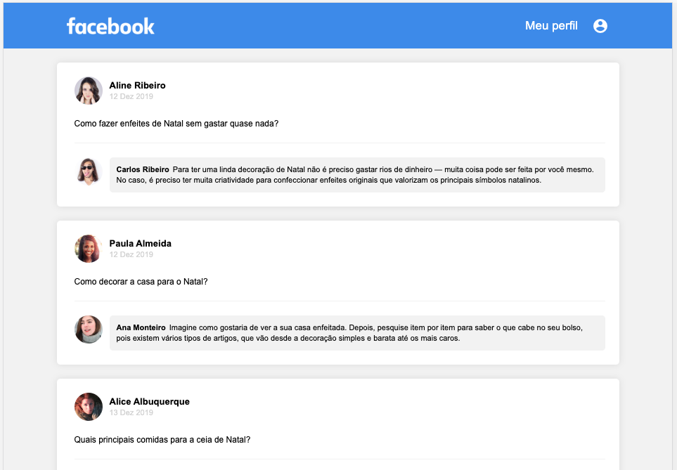

# Face Rocket React
 


## Como acessar o projeto

- Faça o download ou clone do repositório.

- Dentro da pasta do projeto, instalar as dependências
```
npm install ou yarn install
```
- Rodar o projeto no servidor local
```
npm dev ou yarn dev
```
- Acesse http://localhost:8080
